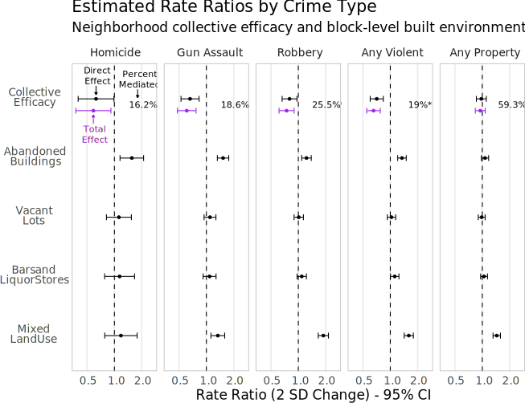
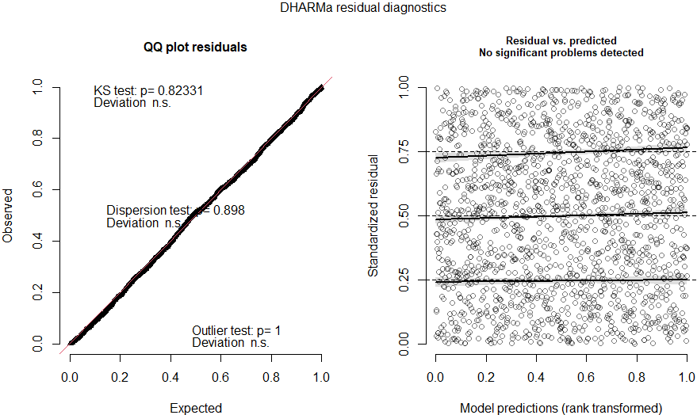
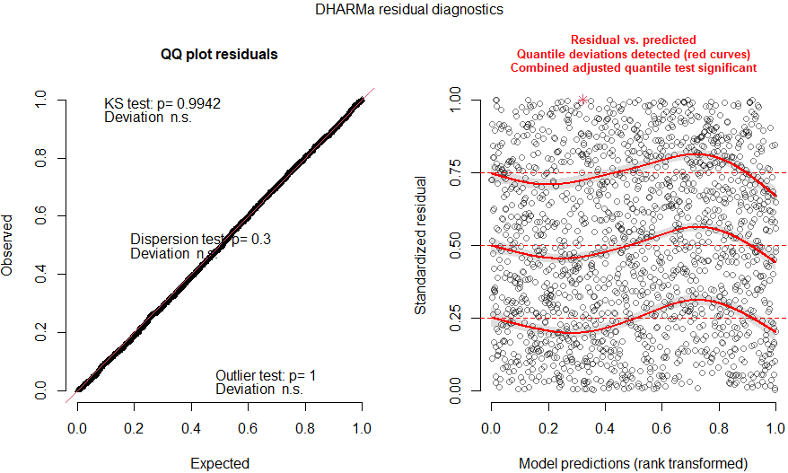

```{r, include=FALSE}
current_count <- 0
cit <- function(x){
  current_count <<- current_count + 1
  current_count
}

```

# Overview

* Collective Efficacy

* Extending Collective Efficacy

* The Built Environment and Generative Disorder

* Data and Modeling Strategy

* Results

* Takeaways, Caveats, and Next Steps

???

Thanks for having me.

Today I'm presenting a small piece of my dissertation, which uses routine activities theory to extend collective efficacy to alternate pathways of crime control--today I'll specifically be talking about collective efficacy, the built environment, and crime.

To set this up, I'll first provide a description of collective efficacy and then my integrative framework

---
# Collective Efficacy

.image-full[

]

???

Sampson and colleagues conceptualize collective efficacy as a neighborhood level capacity for achieving an intended affect, such as regulating youth behavior or maintaining public order. This term is borrowed from Bandura's collective efficacy--a social-psychological group analogue to self-efficacy--which he applied to any tasks requiring group coordination.

This capacity represents an active process by which latent social capital resources--like norms, trust, cohesion...

are translated into action--like informal social control, such as residents sanctioning norm violators.

Efficacy is typically measured using a combination of neighborhood social cohesion and expectations that neighbors will engage in social control.

--

???

The classic constructs of social disorganization theory--socioeconomic disadvantage, residential instability, and racial/ethnic heterogeneity---inhibit collective efficacy by, respectively, depriving the community of resources, disrupting social ties, and impeding the realization of common values.

Existing work in this area has largely focused on the task of crime and disorder control via informal social control.

But this is not the only action communities can (or do) take to control crime.

My dissertation is concerned with these other actions.

---
# Suggestive Evidence

.image-full[

]

???

In our recent review of causal evidence for collective efficacy and broken windows, we drew attention to field experiments that reduced serious crime by clearing vacant lots and remediating abandoned buildings (Kondo et al. 2018), and observational studies suggesting some disorder generates criminal opportunities (e.g. O’Brien & Sampson 2015). 

This reveals gaps in the literature as work on collective efficacy is weakly connected to the built environment and criminal opportunity.

My dissertation integrates the built environment and elements of broken windows into the collective efficacy framework using concepts from the routine activities theory of criminal opportunity.

Routine activities describes crime as the result of the convergence in time and space of a motivated offender, a suitable target, and the absence of a capable guardian.

---
# My Framework

.image-full[

]

???

My dissertation examines how neighborhoods regulate crime by influencing the presence and convergence of motivated offenders, suitable targets, and capable guardians. 

The conventional collective efficacy model, for example, focuses on how neighborhoods increase guardianship by strengthening informal social control and reduce motivated offenders through socialization.

The three chapters of my dissertation examine how communities also address crime collectively by altering the built environment... working with law enforcement... and addressing disorder that generates criminal opportunities. 

--

???

I integrate these into a collective efficacy framework using elements from Bandura's original collective efficacy formulation.

These elements are relevant to making demands of institutions like local government and the police.

They include resources like political clout and legal expertise, and also expected behavior of actors (including street-level bureaucrats like police).

For example, rather than considering perceived police legitimacy and effectiveness to be separate from collective efficacy, I relocate it as a component of the process--expected agent behavior, analogous to resident expectations for social control.

---
# Today's Focus

.image-full[

]

???

The focus for today, however, is not directly on institutional influence or behavior, but rather on the relationship between collective efficacy and elements of the built environment that generate criminal opportunities.

This includes some typically regarded as disorder or decay in the broken windows tradition--abandoned buildings, bars and liquor stores, vacant lots.

But whereas broken windows claims disorder increases crime by suppressing social control or emboldening criminals, I focus on disorder that provides opportunities from a routine activities perspective.

I call this generative disorder, to distinguish it from symptomatic disorder that is just an indicator of neglect or deviance.

---
# Built Environment &#8594; Crime

Crime is *highly* spatially concentrated.<sup>`r cit()`</sup>

Concentrations are largely determined by characteristics of the built environment.<sup>`r cit()`</sup>

???

The extensive literature on situational opportunity tells us crime is highly concentrated in particular areas. In even the highest crime neighborhood, most street segments or corners are nearly crime free. 

Where crime is concentrated is strongly linked to features of the built environment.

--

Effects of the built environment are typically specific to criminal opportunities:

* Vacant lots and abandoned buildings facilitate gun violence by acting as illicit firearm storage<sup>`r cit()`</sup>

???

Different features are typically linked more strongly to specific forms of crime than crime in general.

The literature suggests some contexts which constitute generative disorder by precipitating serious crime. Today I'm looking at a select few.

First, MacDonald & Branas suggest vacant lots and buildings are used for storing illicit firearms so they're easy to access but won't be picked up in police frisks.

--

* Liquor stores and bars increase motivated offenders for assaults, provide vulnerable targets for robberies<sup>`r cit()`</sup>

???

Second, bars and liquor stores may promote altercations due to intoxication, and intoxicated people are also easy targets for robbery.

--

* Mixed land use impedes surveillance and interaction, provides targets for robbery and property crime<sup>`r cit()`</sup>

???


Lastly, mixed land use also leads to crime by increasing the flow of strangers and providing property crime targets

Mixed land use has been used as a control in past studies of collective efficacy as well.

---
# Collective Efficacy &#8594; BE

* Residents, rightly or not, associate features of the environment with crime and disorder<sup>`r cit()`</sup>

   * Vacant Lots
   * Abandoned Buildings
   * Bars and Liquor Stores
   * Businesses and Services
   * Public Housing

???

Just as researchers recognize the connection between land use and crime, residents also perceive these associations, often limiting their exposure to these contexts and reporting them as problems in their community in interviews and surveys.

When they're not present, residents still worry that these different contexts will come to their neighborhoods.

--

* Collective efficacy may facilitate altering or removing these through different actions.

   * Public Meetings and Legal Actions<sup>`r cit()`</sup>
   * Invoking Enforcement Bodies<sup>`r cit()`</sup>
   * Protests<sup>`r cit()`</sup>
   * Direct Clean-Up and Remediation<sup>`r cit()`</sup>

???

A large body of literature finds residents act collectively to address perceived problems in the built environment like these.

And, they frequently do so through political or bureaucratic routes, like taking legal action, attending meetings, making 311 calls, or protesting.

In some cases, they also directly address these conditions--though they are frequently out of their direct influence due to property ownership.

--

???


The idea that residents work collectively to alter their built environment is obviously not a new insight: This part of my dissertation is about more strongly linking the extensive literature on political economy of place--like that of Logan and Molotch--and public social control--like that of Maria Velez and Robert Bursik--into the collective efficacy framework. 

That is, I am situating these different pathways of crime and disorder control in a general collective efficacy framework.

---
# Hypotheses

* Features of the built environment partially mediate the effect of collective efficacy on crime.

???

Today I will show tests of a few hypotheses that emerge from this framework using one set of data from my dissertation.

The first is that built environment features that generate criminal opportunities mediate some of the effect of collective efficacy on crime.

If this capacity for collective action enables neighborhoods to prevent or remove criminogenic contexts, I expect that some of the relationship between collective efficacy and crime is due to variation in these contexts of opportunity.


--

* Built environment features produce opportunities:

   * Abandoned buildings and vacant lots increase homicide and gun violence
   * Bars and liquor stores increase violence and robberies
   * Mixed land use increases robbery and property crime

???

My next hypotheses are based on the expectation that features of the built environment mainly predict crimes for which they provide an opportunity.

For example, if MacDonald & Branas's findings from Philly generalize to Chicago, abandoned buildings and vacant lots may predict crimes involving guns.

Similarly, I expect bars and liquor stores to promote general violence and robbery, and mixed land use to promote property crime and robbery.

I'll note that these are what I expect to be the strongest crime-specific effects but spillover between crime types is likely. 

Among other possibilities, robberies and assaults can easily become murders, and vacants can facilitate drug use which can lead to other crimes. 

---

.image-tall[

]


???

For today's example, I am using a small subset of my dissertation data based on the community survey in the 2001 through 2003 Chicago Community Area Health Study.

This survey is a second wave of the 1995 PHDCN community survey used in the original collective efficacy papers by Sampson & colleagues. It provides reliable measures of collective efficacy and the structural variables at the neighborhood-cluster level. These clusters are 343 sets of about 3 census tracts each which are fairly homogeneous on structural measures.

While I'm using pre-existing neighborhood measures in this example, I use my own measurement models elsewhere in the dissertation and am happy to chat about them at the end if interested.

The CCAHS also provides systematic social observation measures of a random sample of census blocks within each neighborhood cluster. 

For this, trained raters observed all block faces in the sampled blocks, recording information on disorder and the built environment--like abandoned buildings. I aggregate these face measures to the census blocks.

--

???

I wanted to control for population density at the block level, but the CCAHS, like the PHDCN, was sampled using 1990 Census boundaries, so I take 2000 Census block populations and areal weight them to the 1990 boundaries.

--

???

I then link this to geoidentified incident-level crime data from the three years after the CCAHS to get block-level counts of incidents of five types of crime.

These crime data are only available from 2001 onward, which is among the reasons why I'm using the CCAHS instead of the PHDCN (or both as a panel) for these analyses.

(I am doing NC-level panel models for Chicago--which I have an example of in my appendices--and tract and street-segment panels and cross-sections in Seattle which I've left out for today, but am happy to chat about)

--

???

With all this, I ran two sets of models:

I model the direct effects on crime with negative binomial models with cluster-level random intercepts, which I present in full, and I estimate mediation separately in structural equation models, which I summarize.

---
.image-tall[

]

???

This image graphically depicts the statistical models. My main interest is the bold pathways, while thin lines are controls.

I focus here on five classes of crime chosen due to their link to measurable block-level opportunities and seriousness.

Accuracy of reporting tends to be higher for the more serious crimes--homicide and gun violence in particular--while variation in less serious crimes will contain more reporting bias which is likely positively associated with efficacy.

All built environment measures are proportions of block faces in census blocks with that feature present. A proportion of 1 for abandoned buildings, for example, means that every block face in that census block has at least one abandoned building.

Block-level density here has a quadratic term to address a non-linear residual correlation in most of the models.

---

.image-tall[

]

???

This dot plot depicts incidence rate ratios for my primary predictors of interest. Each column is a model for a different crime type. 

Estimates displayed are from 2 standard deviation differences in predictors to facilitate effect size comparisons.

For reference, 2 SD is .41 proportion for abandoned buildings and .65 for mixed land use. That is, going from no abandoned buildings to abandoned buildings on 40% of the faces in a block would increase expected homicide by about 60%

--

???

Purple depicts the estimated total effect of collective efficacy, while black is the direct effect. 

The percentage is the total amount mediated by the combination of the four built environment variables. Starred mediations are significant combined indirect pathways in the structural equations.

--

???

The main results of interest are that the built environment factors significantly mediate collective efficacy in most of the models. 

Additionally, their direct associations vary across crime types mostly in line with expected opportunity differences. 

Abandoned buildings have stronger associations with severe violence... while mixed land use is a better predictor of instrumental crime and minor violence. There is not much association for vacants or bars and liquor stores however.

Some of these built environment direct associations are comparable in magnitude or even larger than neighborhood efficacy as well--such as for abandoned buildings and gun assaults.

--

???

While these may look like fairly modest partial mediations, consider this is a small, convenience selection of built environment characteristics. I suspect this mediation would be stronger with better and more comprehensive built environment measures. Or a more granular unit of analysis.

Also I'll will note that effects are stronger in nonlinear transformations: As one might expect, marginal effects of opportunity differences are stronger at the low end. Square roots perform notable better, which is common for proportional predictors.

I present the linear here because they're conservative and I don't like arbitrary posthoc transformations on variables of interest. I do have a table with the square root transforms in my appendix if interested. I also have some model fit diagnostics in there too.

---
## Takeaways, Caveats, Next Steps


* Abandoned buildings predict homicide and gun violence

* Mixed land use predicts robbery, property crime, less severe violence

???

So, I have a few takeaways, caveats, and directions to take this.

First, abandoned buildings and mixed land use results are in-line with opportunity effects, but they need to be tested elsewhere and the mechanisms probed.

THese results are also suggested in my longitudinal data in Chicago and Seattle, and cross-sections in Seattle, though the quality of measures and statistical power vary widely. I have more to do though before I consider this finding particularly robust--though a lot of past work finds similar results.

--

* Minimal association between bars and liquor stores or vacant lots and crime

???

In contrast to buildings and land use, though, I don't see much relationship from bars and liquor store or violent lots.

I was expecting more of an effect here, in line with past research, but I speculate the functions and social meanings of these places, and thus their effects, are more heterogeneous than abandoned buildings. For instance, a fancy cocktail bar is being treated equally to a dive bar here. 

I'm planning on testing this in my Seattle data, using liquor violation and noise complaint data to isolate problem bars in Seattle. I'm waiting on a COVID-delayed public data request since violations in Washington aren't public record.

I also suspect all built environment features have effects conditional on the social structure of the community--this is a common finding in the opportunity literature. The strong effects of vacant lots in MacDonald & Branas's field experiments are from those in poorer, higher crime neighborhoods. Examining multilevel interactions is an obvious next step but requires a lot of power, which is easier in my more recent Seattle data.

--

* Built environment features mediate collective efficacy

   * Need to investigate mechanisms
   * Importance of institutional connections
   * Implications for neighborhood stratification

???

Lastly, and most importantly, a significant portion of collective efficacy associations with crime are attributable to these block-level characteristics. That doesn't necessarily indicate my proposed mechanisms though. To tease this out, I'm of course using other quantitative data, but I'm also doing archival work investigating neighborhood collective action in Seattle to alter the built environment for crime control.

If this pans out, this pathway is particularly important because changes to the environment don't require continued intervention, thus making them stable and low cost to residents.

St. Jean's ethnographic work in Chicago, for instance, suggests people fatigue rapidly from engaging in informal social control, so this may augment direct interventions. 

Making these environmental changes, however, often requires working through institutions that may be unresponsive or even hostile--especially to poor and non-white neighborhoods. 

That is to say, crime in these places is not simply the result of residents unwilling or even unable to take action--responsiveness of other actors is important.

--

???

In that vein, the literature on the political economy of place and public social control tells us that differences in the ability to regulate the built environment contributes to race and class stratification. The ability of one neighborhood to exert control over its space can produce metro-wide consequences. 

For example, I think some portion of the effects of collective efficacy result from collective action concentrating disadvantage elsewhere in the metro area. For example, many authors have found collective action by affluent white neighborhoods, mainly via local government, helps maintain housing segregation and concentrate public housing in poor neighborhoods.

This has ramifications for concentration of disadvantage and thus crime, implicating collective efficacy in the process. I'm hoping to look at these slower, metro-wide processes in the long term.

---
class: inverse
# Thank You!

???

With that, I'm happy to take questions.

---
class: inverse
# Appendices

```{r, include=FALSE, warning=FALSE, message=FALSE, results="hide"}
load("../../projects/built_environment/output/chicago/models/ccahs_glmer_1_2.RData")
library(gt)
```

---
## Base Model Results

.smaller[
```{r, echo=FALSE, results='asis'}
table_ccahs_glmer_1
```
]

???

I'd focus on the SEM but R's lavaan package doesn't do count models so I fit linear models on the inverse hyperbolic sine of the counts. The direct effects are comparable to the negative binomial models in direction and significance though and expected values are very similar. Yihs = log(y + sqrt(1+y^2))

Density a better block-level predictor than pop alone or and pop and area separate.

Pop a better neighborhood level predictor than density, but not major except for gun assault anyway.

---
## Square Root Transformations

.smaller[
```{r, echo=FALSE}
table_ccahs_glmer_sq
```
]

???

Effects are stronger in nonlinear transformations: As one might expect, marginal effects of opportunity differences are stronger at low end. Binary measure actually performs as well as a continuous one; square root performs best however. Presenting linear because they're conservative and I don't like arbitrary posthoc transformation on vars of interest.

---
# First Stage Effects

.image-full[

]

---
# Homicide Fit

.image-full[

]

???

Left depicts binned residual QQ plot--the recommended (by Gelman & Hill) way to evaluate GLMMs. They divide data into bins on fitted values, then plot average residual against average fitted value within bins. The right plots depict quantile deviations based on differences between simulated model predictions and standardized residuals.


Homicide fits incredibly well.

---
# Gun Assault Fit

.image-full[

]

???

Overall fit for gun assault is still excellent but has a bit of nonlinear residual correlation, though not consequential. It disappears if you change control specifications, mainly putting a curve on disadvantage, with no notable impact on the BE parameters.

---
## Chicago NC-Level Models

```{r, include=FALSE, warning=FALSE, message=FALSE, results="hide"}
load("../../projects/built_environment/output/chicago/models/panel_nc_table.RData")
```
.smaller[
```{r, echo=FALSE}
panel_nc_table
```

]

???

Problem here is the SSO was only done in 80 NCs in the PHDCN. The overlap between the CCAHS and PHDCN results in 77 usable NCs with everything.

Sample size here is quite small for number of parameters and including weak predictors eats away power. Still see effects for bars and liquor stores on perceived violence, abandoned buildings on violence.

I don't have the PHDCN-CS tract crosswalk, otherwise I'd fit a tract-level panel here, but not sure what CCAHS reliability looks like at that level.

These replicate in Seattle data as well--more power there at segment level but worse crime measures.

---
## Citations

.smaller[

1. Sherman, Lawrence W., Patrick R. Gartin, and Michael E. Buerger. 1989. “Hot Spots of Predatory Crime: Routine Activities and The Criminology Of Place.” *Criminology* 27(1):27–56.

2. Wilcox, Pamela, and Francis T. Cullen. 2018. "Situational Opportunity Theories of Crime." *Annual Review of Criminology* 1(1):123–48.

3. MacDonald, John, Charles Branas, and Robert Stokes. 2019. *Changing Places: The Science and Art of New Urban Planning.* Princeton, N.J: Princeton University Press.

4. Wheeler, Andrew P. 2019. "Quantifying the Local and Spatial Effects of Alcohol Outlets on Crime." *Crime & Delinquency* 65(6):845–71.

5. Sampson, Robert J., and Stephen W. Raudenbush. 1999. "Systematic Social Observation of Public Spaces: A New Look at Disorder in Urban Neighborhoods." *American Journal of Sociology* 105(3):603–51.

6. Innes, Martin. 2004. “Signal Crimes and Signal Disorders: Notes on Deviance as Communicative Action.” *The British Journal of Sociology* 55(3):335–55.

7. Einstein, Katherine Levine. 2020. *Neighborhood Defenders: Participatory Politics and America’s Housing Crisis.* First. New York: Cambridge University Press.

8. Carr, Patrick J. 2005. *Clean Streets: Controlling Crime, Maintaining Order, and Building Community Activism.* New York: New York University Press.

9. Rabrenovic. 1996. *Community Builders: A Tale of Neighborhood Mobilization in Two Cities.* Philadelphia: Temple University Press.

10. Kelling & Coles. 1996. *Fixing Broken Windows: Reducing Order and Reducing Crime in Our Communities.* New York: Touchstone.

]

---
## Other References

.smallish[
Bursik, Robert J. 1989. "Political Decision-Making and Ecological Models of Delinquency: Conflict and Consensus." In Messner, Krohn, and Liska (eds.) *Theoretical Integration in the Study of Deviance and Crime.* Albany, N.Y.: State University of New York Press.

Lanfear, Charles C., Ross L. Matsueda, and Lindsey R. Beach. 2020. “Broken Windows, Informal Social Control, and Crime: Assessing Causality in Empirical Studies.” *Annual Review of Criminology* 3(1):97–120.

Sampson, Robert J., and Stephen W. Raudenbush. 1999. “Systematic Social Observation of Public Spaces: A New Look at Disorder in Urban Neighborhoods.” *American Journal of Sociology* 105(3):603–51.

St. Jean, Peter K. B. 2008. *Pockets of Crime: Broken Windows, Collective Efficacy, and the Criminal Point of View.* Chicago: University of Chicago Press

Velez, Maria B. 2001. "The Role of Public Social Control in Urban Neighborhoods: A Multilevel Analysis Of Victimization Risk." *Criminology* 39(4):837–64.
]
